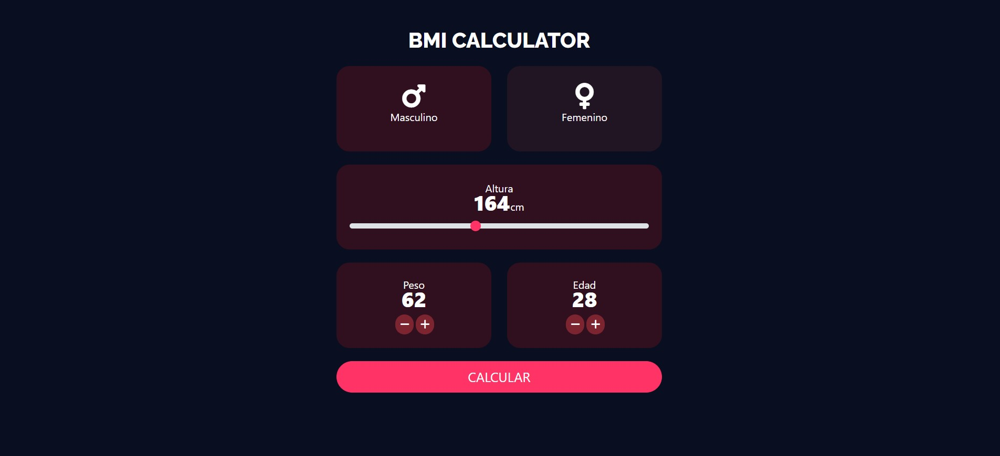
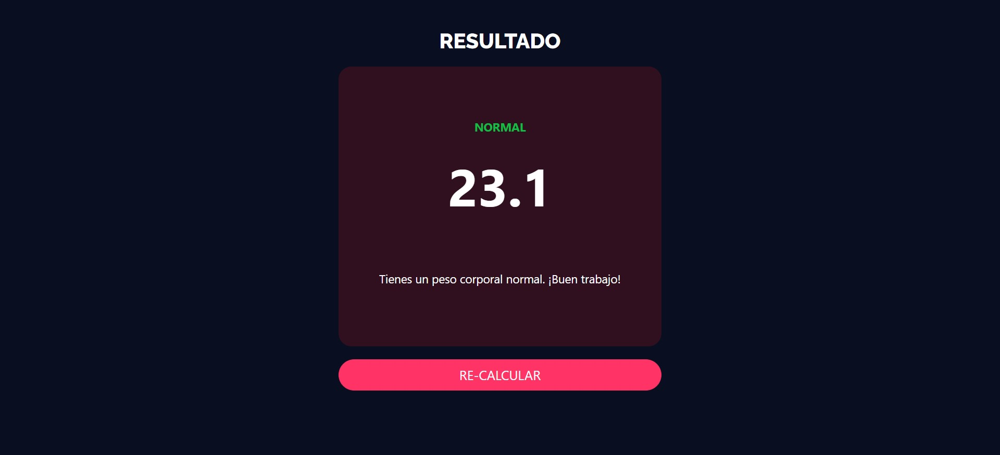

# Angular BMI Calculator

App con Calculadora del Indice de Masa Corporal (BMI) usando Angular. 

## Configuración

Ejecuta `ng serve` y navega en `http://localhost:4200/` para visualizar el proyecto.

## Vista Previa

